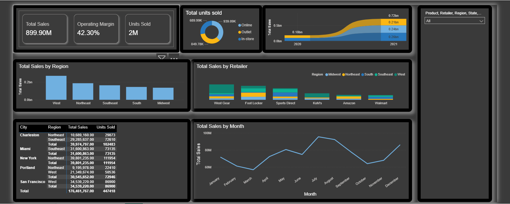

# Aditya-Naik
# Hi, I'm Aditya Naik 👋

🎓 Pursuing B.E.
📊 Aspiring Software Engineer passionate about solving problems through my coding skills.

## 🔧 Skills

* Programming:Python,Java,C++
* Data Visualization (Matplotlib, Seaborn)
* SQL (Basics)
* Exploratory Data Analysis (EDA)
* Data Structures and Algorithms
* Object-Oriented Programming
* Git&GitHub
* Problem Solving

## 📂 Projects

*  Zomato Data Analysis
*  Flight Price Analysis
*  Customer Churn Analysis
*  World Literacy Map
*  Web-Scraper using Djnago

## 🚀 What I'm Working On

* Improving data storytelling
* Building more real-world projects
* Django
* Flask

# 📊 Dashboard Showcase

## Adidas Dashboard

## Achievements
### Leetcode 50-Day Badge

